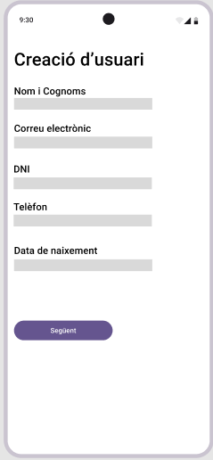
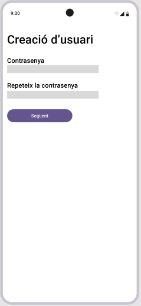

# ProjSprints-AntonioSusany

Para hacer login en la aplicación, el usuario tendrá que ingresar usuario y contraseña

Si el usuario es nuevo y se tiene que crear una nueva cuenta:

 Aqui el usuario ingresara varios datos personales

Cuando acabe pulsará el botón y tendrá que ingersar la contraseña y pulsar el siguiente:

