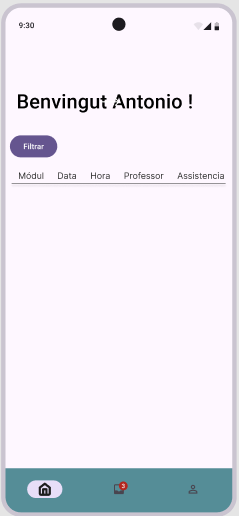

# ProjSprints-AntonioSusany

Para hacer login en la aplicación, el usuario tendrá que ingresar usuario y contraseña

Si el usuario es nuevo y se tiene que crear una nueva cuenta:

 Aqui el usuario ingresara varios datos personales

Cuando acabe pulsará el botón y tendrá que ingersar la contraseña y pulsar el siguiente:

Una vez el usuario esta creado saldrá un mensaje como el siguiente:

## ALUMNO

Para el alumno, el usuario tendra un menu inferior constante en el que tendra tres apartados:

# HOME

# INBOX

# DATOS PERSONALES

## PROFESOR

# HOME

# INBOX

# DATOS PERSONALES

# PASSAR LLISTA

## ADMIN

